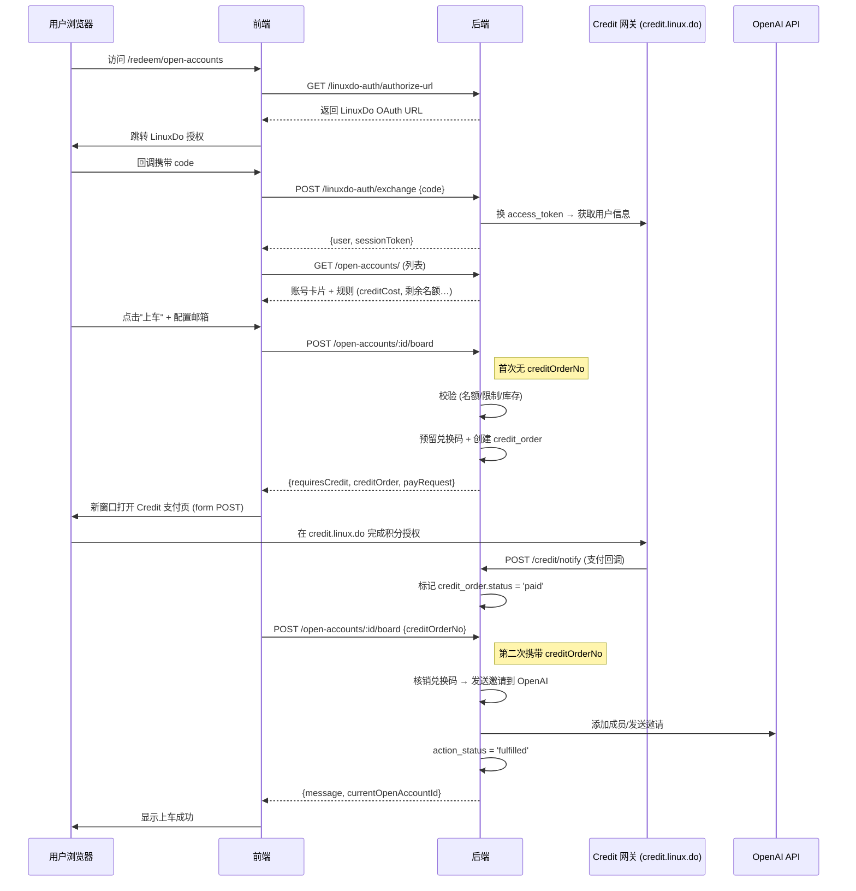

# LinuxDo 积分商品功能分析

本文档分析项目中与 **LinuxDo 积分 (Credit)** 有关的购买、使用流程和功能架构。

---

## 一、核心概念

| 概念 | 说明 |
|------|------|
| **LinuxDo Credit (LDC)** | LinuxDo 平台的虚拟积分货币，通过 `credit.linux.do` 网关流转 |
| **开放账号** | 管理员标记为 `is_open=1` 的 ChatGPT Team 共享账号 |
| **上车** | 用户消耗 LDC 获取某个开放账号的邀请席位 |
| **兑换码 (redemption_codes)** | 底层库存载体，渠道为 `linux-do`，绑定具体 ChatGPT 账号邮箱 |
| **Credit 订单 (credit_orders)** | 用户在开放账号场景下的支付/消费记录 |

---

## 二、功能架构

### 2.1 涉及的文件

**后端**

| 文件 | 职责 |
|------|------|
| `routes/open-accounts.js` | 开放账号列表 + 上车核心流程 |
| `routes/credit.js` | Credit 订单的回调、查询、退款、管理 |
| `routes/linuxdo-auth.js` | LinuxDo OAuth 授权 / 换 session |
| `services/credit-gateway.js` | 与 `credit.linux.do/epay` 的签名、提交、查单 |
| `services/open-accounts-redemption.js` | 兑换码预留 / 核销 |
| `middleware/linuxdo-session.js` | LinuxDo session JWT 签发 / 校验 |

**前端**

| 文件 | 职责 |
|------|------|
| `views/LinuxDoOpenAccountsView.vue` | 开放账号卡片页 + 上车交互 |
| `composables/useLinuxDoAuthSession.ts` | LinuxDo OAuth 状态管理 |
| `views/PointsExchangeView.vue` | 站内积分兑换 / 提现（独立于 LDC） |
| `views/CreditOrdersView.vue` | 管理后台 Credit 订单列表 |

### 2.2 数据表

```
linuxdo_users       ─ LinuxDo 用户 (uid, username, email, current_open_account_id)
credit_orders       ─ Credit 订单 (order_no, uid, scene, amount, status, action_status…)
gpt_accounts        ─ ChatGPT 账号 (is_open, user_count, invite_count, expire_at)
redemption_codes    ─ 兑换码库存 (channel='linux-do', account_email, reserved_for_order_no)
```

---

## 三、用户购买流程（端到端）



### 3.1 详细步骤

1. **LinuxDo OAuth 登录**
   - 前端通过 `useLinuxDoAuthSession` 发起 OAuth 授权
   - 后端 `/linuxdo-auth/exchange` 用 code 换 access_token，获取用户 `uid`、`username`、`trust_level`
   - 写入 `linuxdo_users` 表并签发 session JWT

2. **浏览开放账号列表**
   - `GET /open-accounts/` 查询 `gpt_accounts WHERE is_open=1` + 未预留的 `linux-do` 渠道兑换码数量
   - 返回每张卡片的：剩余名额、已加入/待邀请人数、到期时间、折扣后价格

3. **价格折扣计算**
   根据账号到期时间 `expire_at` 自动打折：

   | 剩余天数 | 折扣 |
   |----------|------|
   | < 7 天 | 2 折 |
   | < 14 天 | 4 折 |
   | < 20 天 | 6 折 |
   | < 25 天 | 8 折 |
   | ≥ 25 天 | 原价 |

4. **首次点击"上车"（创建订单）**
   - 校验：维护模式 / 屏蔽时段 (00:00-08:00) / 全局日限额 / 用户日限额 / 账号满员(5人) / 邮箱配置
   - 预留一个 `linux-do` 渠道兑换码 → `reserved_for_order_no`
   - 创建 `credit_orders` 记录（场景=`open_accounts_board`）
   - 返回 `requiresCredit=true` + 签名参数，前端 form POST 到 `credit.linux.do/pay/submit.php`

5. **用户在 Credit 网关支付**
   - 用户在 `credit.linux.do` 授权扣除 LDC
   - 网关异步回调 `POST /credit/notify`，后端验签后标记订单 `status=paid`

6. **二次上车（携带 creditOrderNo）**
   - 前端轮询订单状态，确认 `paid` 后再次调用 `POST /open-accounts/:id/board`
   - 后端：验证订单 → 核销兑换码 → 调用 OpenAI API 发送邀请 → 更新 `linuxdo_users.current_open_account_id`
   - `action_status` 更新为 `fulfilled`

---

## 四、限流与保护机制

| 机制 | 配置 | 默认值 |
|------|------|--------|
| 全局每日上车上限 | `OPEN_ACCOUNTS_DAILY_BOARD_LIMIT` | 10 |
| 用户每日上车限制 | `OPEN_ACCOUNTS_USER_DAILY_BOARD_LIMIT` | 1 |
| 订单过期时间 | `CREDIT_ORDER_EXPIRE_MINUTES` | 15 分钟 |
| 兑换屏蔽时段 | 凌晨 0:00 ~ 8:00 | 固定 |
| 维护模式 | `OPEN_ACCOUNTS_ENABLED` | true |
| 并发锁 | `withLocks([uid, accountId])` | - |
| 短重试 | 429/403/5xx 错误自动重试 | 3 次 |

---

## 五、订单状态流转

```
credit_orders.status:
  created → pending_payment → paid → (refunded)
                                   ↓
credit_orders.action_status:
  NULL → processing → fulfilled / failed
```

- **created**: 订单已创建，兑换码已预留
- **pending_payment**: 已生成支付链接，等待用户授权
- **paid**: Credit 网关回调确认支付成功
- **refunded**: 管理员手动退款
- **action_status=fulfilled**: 邀请已发送，上车完成
- **action_status=failed**: 上车失败（如 OpenAI 限流或满员）

---

## 六、库存管理

开放账号的「剩余名额」= 对应账号邮箱下**未使用、未预留**的 `linux-do` 渠道兑换码数量。

**补充库存步骤：**

1. 进入管理后台 `/admin/redemption-codes`
2. **生成兑换码**：渠道选 `linux-do`，绑定账号邮箱选择目标 ChatGPT 账号
3. 生成后前台对应账号名额自动增加

---

## 七、与站内积分 (Points) 的区别

| 对比项 | LinuxDo Credit (LDC) | 站内积分 (Points) |
|--------|----------------------|-------------------|
| 来源 | LinuxDo 平台 `credit.linux.do` | 注册奖励 / 邀请奖励 / 购买奖励 |
| 用途 | 开放账号上车 | 兑换 Team 席位 / 解锁邀请 / 提现 |
| 支付网关 | Credit 网关 (MD5 签名) | 无外部支付 |
| 对应路由 | `/open-accounts/*`、`/credit/*` | `/users/points/*` |
| 对应页面 | `/redeem/open-accounts` | `/points` |

---

## 八、管理后台功能

- **Credit 订单管理** (`/admin/credit-orders`)：查看所有 Credit 订单、手动同步状态、退款
- **兑换码管理** (`/admin/redemption-codes`)：生成/管理 `linux-do` 渠道兑换码 = 库存管理
- **系统设置** (`/admin/settings`)：配置 LinuxDo OAuth 凭据、Credit PID/KEY、功能开关

---

## 九、关键环境变量

```bash
# LinuxDo OAuth
LINUXDO_CLIENT_ID=
LINUXDO_CLIENT_SECRET=
LINUXDO_REDIRECT_URI=

# LinuxDo Credit 网关
LINUXDO_CREDIT_PID=
LINUXDO_CREDIT_KEY=
LINUXDO_CREDIT_BASE_URL=https://credit.linux.do/epay

# 积分商品配置
OPEN_ACCOUNTS_CREDIT_COST=30                    # 上车所需 LDC
OPEN_ACCOUNTS_CREDIT_TITLE=开放账号上车          # 订单标题
OPEN_ACCOUNTS_DAILY_BOARD_LIMIT=10              # 全局日限
OPEN_ACCOUNTS_USER_DAILY_BOARD_LIMIT_ENABLED=true
OPEN_ACCOUNTS_USER_DAILY_BOARD_LIMIT=1
CREDIT_ORDER_EXPIRE_MINUTES=15                  # 订单超时
OPEN_ACCOUNTS_ENABLED=true                      # 功能开关
```
